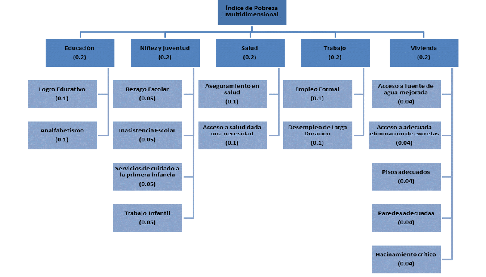

## ÍNDICE DE POBREZA MULTIDIMENSIONAL

- Para el desarrollo de este índice se pueden resumir las variables en 5 dimensiones, donde cada dimensión pesa lo mismo.  Esto se resume en el siguiente diagrama
  
	- #Educación
	- #[[Niñez y juventud]]
	- #Salud
	- #Trabajo
	- #Vivienda
- La justificación de estas variables/dimensiones utilizadas para la creación de este índice se pueden leer en ((663a2a8a-4221-41ce-b207-d9de27710a14))